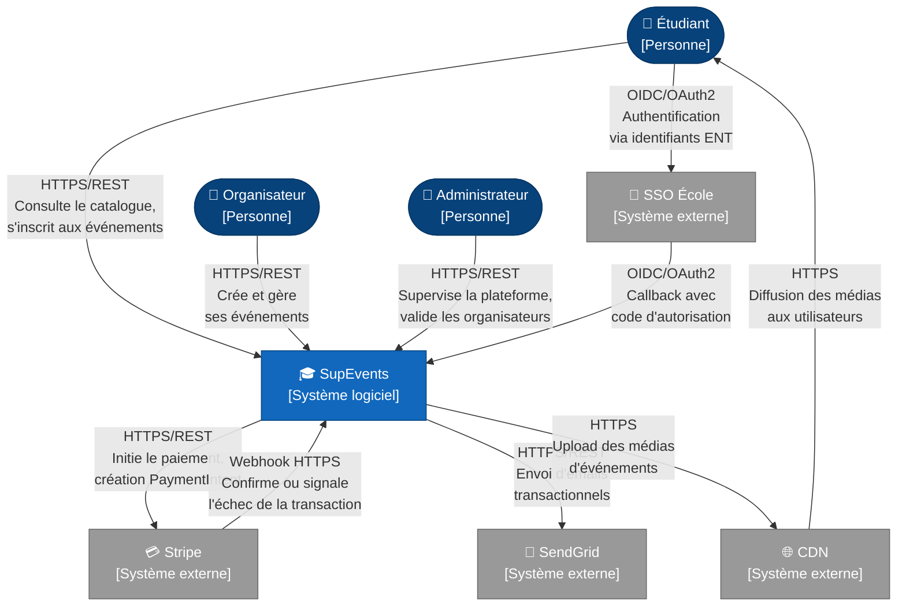
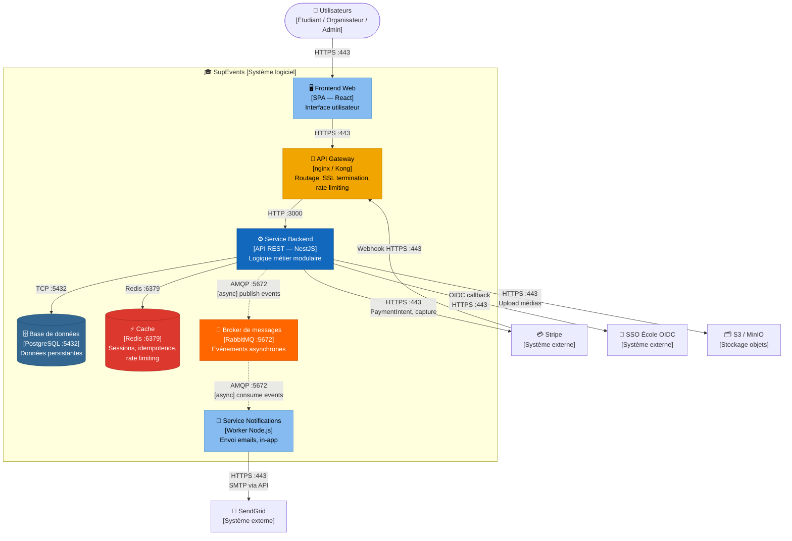
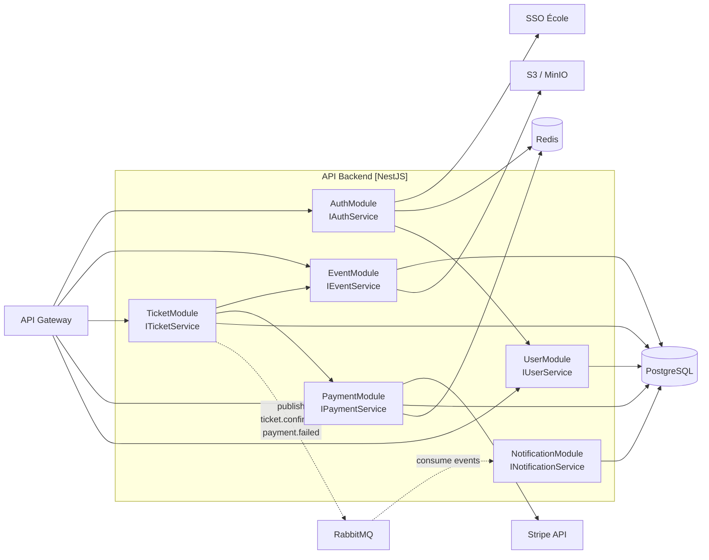

# §6.1 — Vue logique

*Dernière mise à jour : 13/05/2026*

Cette section présente l'architecture de SupEvents à travers deux niveaux du modèle C4 : le diagramme Context, qui situe le système dans son environnement humain et technique, et le diagramme Containers, qui détaille les blocs déployables qui composent SupEvents. Ces deux vues sont destinées aux développeurs, aux architectes et aux décideurs techniques qui rejoignent le projet.

---

## §6.1.1 — Diagramme C4 Context

Ce diagramme donne une vue "grand angle" du système SupEvents : qui l'utilise, avec quels systèmes tiers il interagit. Il ne descend pas dans les détails internes mais permet de comprendre immédiatement le périmètre et les dépendances externes. Il est destiné à tout interlocuteur technique ou métier qui souhaite comprendre le positionnement du système sans entrer dans son architecture.

Le point notable est la séparation stricte entre les acteurs humains (Étudiant, Organisateur, Administrateur) et les systèmes tiers automatisés (Stripe, SendGrid, SSO École, CDN). Les interactions humaines passent toutes par le frontend SPA, tandis que les interactions avec les systèmes tiers sont orchestrées côté backend — à l'exception du CDN qui sert directement les assets statiques.

---

## §6.1.2 — Diagramme C4 Containers

Ce diagramme zoome à l'intérieur de SupEvents et expose les blocs déployables qui le composent, leurs technologies et les protocoles de communication qui les relient. Il est la référence principale pour les développeurs qui configurent l'environnement, les devops qui orchestrent le déploiement, et les architectes qui évaluent les points de couplage.

L'architecture suit un pattern classique à deux niveaux : un frontend SPA servi par CDN, un backend monolithique modulaire exposé via API Gateway. Le découplage asynchrone entre le backend et le service de notifications est assuré par RabbitMQ — choix documenté dans ADR-001. Les flux synchrones (HTTPS, TCP) sont distingués des flux asynchrones (AMQP) par le style des flèches.

---

## §6.1.3 — Diagramme de composants — API Backend

Ce diagramme décompose l'intérieur du service backend en modules fonctionnels. Il montre les interfaces exposées par chaque module, leurs dépendances entre eux et vers les systèmes tiers. Il est la référence pour les développeurs qui implémentent un module : ils voient immédiatement quels autres modules ils peuvent appeler et lesquels sont hors de leur périmètre.

La décision architecturale clé visible ici est le découplage entre `TicketModule` et `NotificationModule` via RabbitMQ. `TicketModule` n'appelle jamais directement `NotificationModule` — il publie un événement et reprend son exécution sans attendre. Cela garantit que l'envoi d'email ne bloque jamais le parcours d'inscription.

