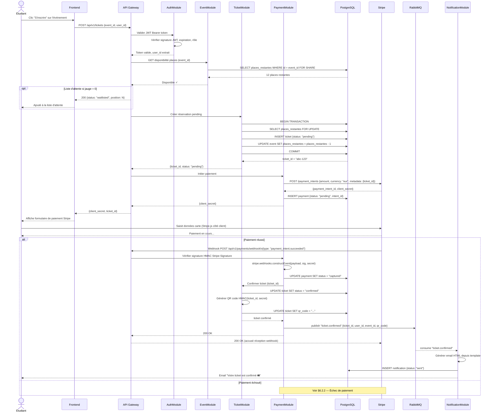
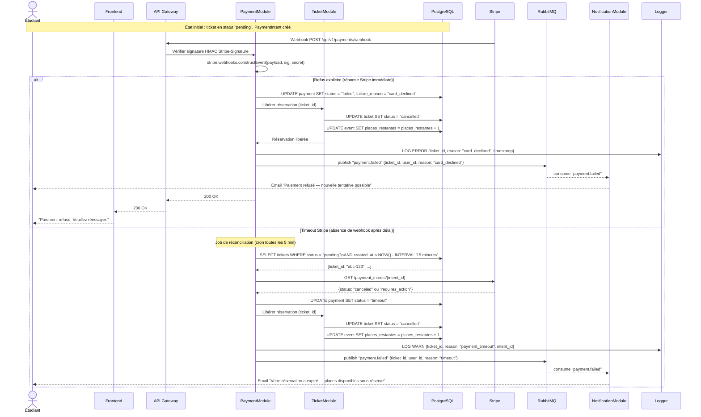

# §6.2 — Vue des processus

*Dernière mise à jour : 13/05/2026*

Cette section documente les flux dynamiques du système SupEvents via des diagrammes de séquence UML. Elle couvre le parcours nominal d'inscription à un événement payant et le cas d'échec de paiement. Ces diagrammes sont destinés aux développeurs qui implémentent les modules concernés et aux testeurs qui définissent les scénarios de test d'intégration.

---

## §6.2.1 — Séquence : Inscription à un événement (parcours nominal)

Ce diagramme couvre le flux complet depuis le clic "S'inscrire" jusqu'à la réception du ticket par email. Il met en évidence l'enchaînement synchrone du parcours de paiement (étapes 1 à 7) et le découplage asynchrone de la notification (étapes 8 à 9). Le point d'architecture clé est l'utilisation de RabbitMQ comme tampon entre la confirmation du ticket et l'envoi email — si SendGrid est indisponible, l'inscription reste confirmée et la notification sera livrée dès la reprise.

---

## §6.2.2 — Séquence : Échec de paiement

Ce diagramme traite les deux cas d'échec distincts lors de la phase de paiement. Le cas de refus explicite (réponse immédiate de Stripe) est le plus simple : la réservation est libérée immédiatement. Le timeout Stripe est plus délicat : en l'absence de webhook, un job de réconciliation périodique doit détecter et libérer les réservations bloquées en statut `pending` depuis plus de 15 minutes.

