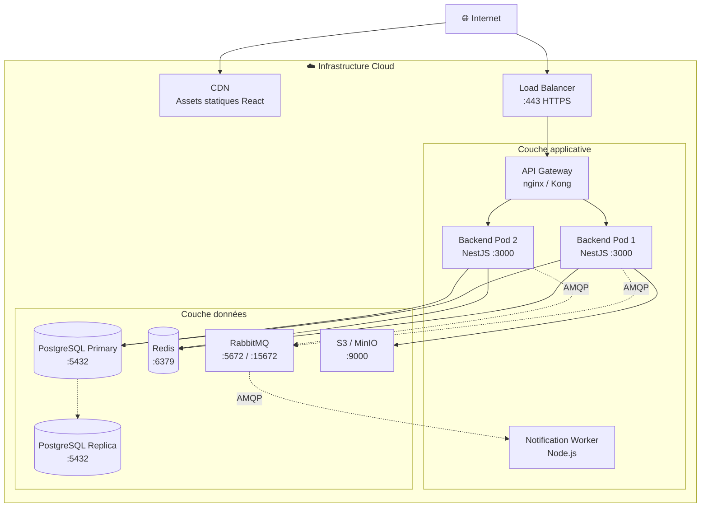

# §6.3 — Vue de déploiement

*Dernière mise à jour : 13/05/2026 — Statut : 🟡 Partiel*

Cette section décrit comment les containers définis en §6.1 sont déployés sur l'infrastructure cible. Elle est destinée aux équipes DevOps et aux architectes d'infrastructure.

> **Note :** Cette section sera complétée en TP 1.8 avec les manifestes Kubernetes et la topologie réseau détaillée. Les grandes lignes ci-dessous sont suffisantes pour guider l'implémentation.

---

## Environnements

| Environnement | Usage | Hébergement |
|---|---|---|
| `development` | Développement local | Docker Compose sur poste développeur |
| `staging` | Tests d'intégration, recette | Cloud (ex : Render, Railway ou VPS) |
| `production` | Mise en production | Cloud (ex : Railway, Fly.io ou VPS dédié) |

---

## Vue de déploiement simplifiée



---

## Configuration Docker Compose (développement)

Le fichier `docker-compose.yml` à la racine du dépôt démarre l'ensemble des services locaux. Les services tiers (Stripe, SendGrid, SSO) sont mockés via des intercepteurs locaux en environnement de développement.

```yaml
# Extrait indicatif — voir docker-compose.yml à la racine
services:
  postgres:
    image: postgres:16
    environment:
      POSTGRES_DB: supevents
      POSTGRES_PASSWORD: devpassword
    ports: ["5432:5432"]
  
  redis:
    image: redis:7-alpine
    ports: ["6379:6379"]
  
  rabbitmq:
    image: rabbitmq:3-management
    ports: ["5672:5672", "15672:15672"]
  
  minio:
    image: minio/minio
    command: server /data --console-address ":9001"
    ports: ["9000:9000", "9001:9001"]
```
