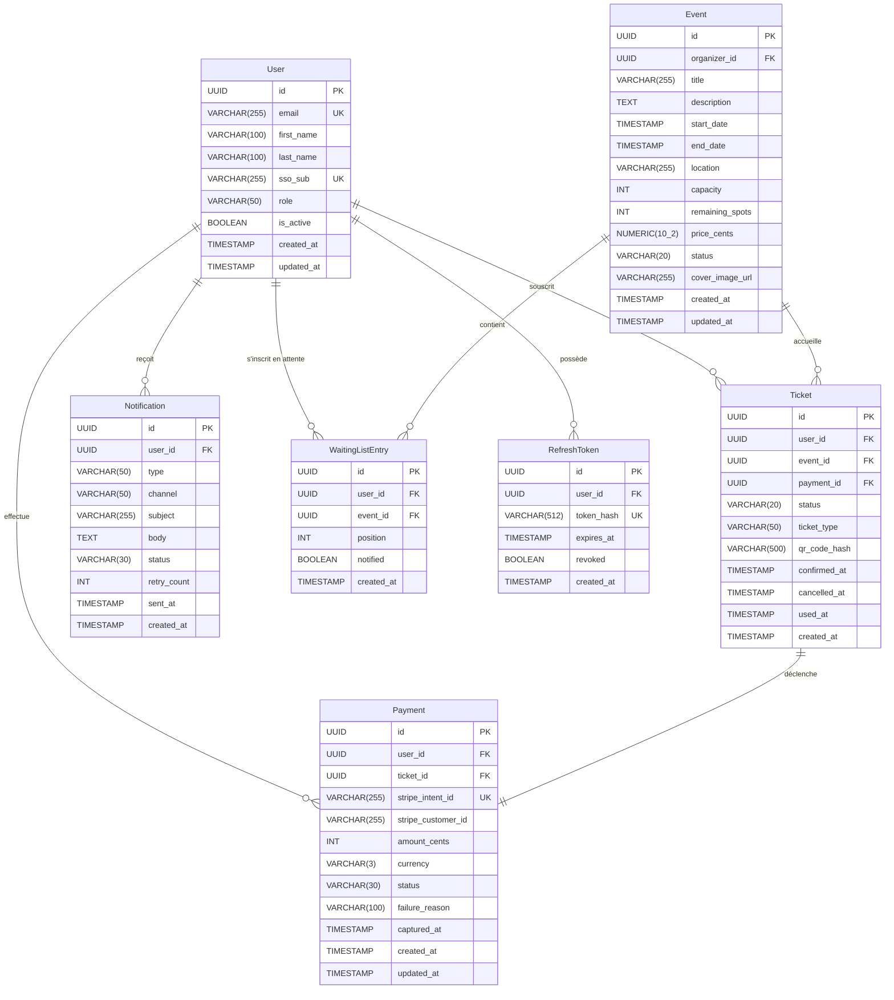

# §6.4 — Vue des données

*Dernière mise à jour : 13/05/2026*

## Modèle entité-relation

Le modèle de données de SupEvents est centré sur trois entités principales : `User` (identité fédérée via SSO), `Event` (événement créé par un organisateur) et `Ticket` (inscription d'un étudiant à un événement). La relation `User → Event` n'est jamais directe : un utilisateur s'inscrit à un événement **via un Ticket**, qui est une entité de plein droit portant le cycle de vie de l'inscription (`pending → confirmed → cancelled → used`). Cette décision garantit la traçabilité complète de chaque inscription et simplifie la gestion des remboursements.

**Points d'architecture notables :** `remaining_spots` est dénormalisé sur `Event` pour éviter un `COUNT` coûteux à chaque vérification de disponibilité — sa cohérence est garantie par les transactions PostgreSQL lors des créations et annulations de tickets. Le champ `qr_code_hash` stocke un HMAC du `ticket_id` et non une image, ce qui maintient la taille de la colonne faible et permet une revalidation sans base de données.

---

## Dictionnaire de données

### Entité `User`

| Champ | Type | Contraintes | Description | Sensibilité RGPD |
|---|---|---|---|---|
| `id` | `UUID` | `PK, NOT NULL, DEFAULT gen_random_uuid()` | Identifiant unique de l'utilisateur | Non |
| `email` | `VARCHAR(255)` | `NOT NULL, UNIQUE, CHECK (email ~* '^[^@]+@[^@]+$')` | Adresse email de l'utilisateur | **Oui** |
| `first_name` | `VARCHAR(100)` | `NOT NULL` | Prénom | **Oui** |
| `last_name` | `VARCHAR(100)` | `NOT NULL` | Nom de famille | **Oui** |
| `sso_sub` | `VARCHAR(255)` | `NOT NULL, UNIQUE` | Identifiant opaque fourni par le SSO école (claim `sub` OIDC) | **Oui** |
| `role` | `VARCHAR(50)` | `NOT NULL, DEFAULT 'etudiant', CHECK (role IN ('etudiant','organisateur','admin'))` | Rôle RBAC de l'utilisateur | Non |
| `is_active` | `BOOLEAN` | `NOT NULL, DEFAULT true` | Compte actif ou désactivé par l'admin | Non |
| `created_at` | `TIMESTAMP` | `NOT NULL, DEFAULT NOW()` | Date de création du compte | Non |
| `updated_at` | `TIMESTAMP` | `NOT NULL, DEFAULT NOW()` | Date de dernière modification | Non |

> **Stratégie RGPD :** `email`, `first_name`, `last_name` sont chiffrés au repos avec AES-256 au niveau applicatif (clé stockée dans le vault). `sso_sub` est un pseudonyme opaque fourni par le SSO — il ne peut pas être lié à l'identité réelle sans accès au SSO. Durée de rétention : 3 ans après la dernière connexion, puis anonymisation (remplacement par un UUID stable pour conserver l'historique des transactions).

### Entité `Event`

| Champ | Type | Contraintes | Description | Sensibilité RGPD |
|---|---|---|---|---|
| `id` | `UUID` | `PK, NOT NULL, DEFAULT gen_random_uuid()` | Identifiant unique de l'événement | Non |
| `organizer_id` | `UUID` | `FK → User.id, NOT NULL` | Référence à l'organisateur créateur | Non |
| `title` | `VARCHAR(255)` | `NOT NULL` | Titre de l'événement | Non |
| `description` | `TEXT` | `NULL` | Description détaillée | Non |
| `start_date` | `TIMESTAMP` | `NOT NULL` | Date et heure de début | Non |
| `end_date` | `TIMESTAMP` | `NOT NULL, CHECK (end_date > start_date)` | Date et heure de fin | Non |
| `location` | `VARCHAR(255)` | `NOT NULL` | Lieu de l'événement | Non |
| `capacity` | `INT` | `NOT NULL, CHECK (capacity > 0)` | Nombre total de places | Non |
| `remaining_spots` | `INT` | `NOT NULL, CHECK (remaining_spots >= 0)` | Places disponibles (dénormalisé) | Non |
| `price_cents` | `NUMERIC(10,2)` | `NOT NULL, DEFAULT 0, CHECK (price_cents >= 0)` | Prix en centimes d'euro (0 = gratuit) | Non |
| `status` | `VARCHAR(20)` | `NOT NULL, DEFAULT 'draft', CHECK (status IN ('draft','published','cancelled','archived'))` | Statut du cycle de vie | Non |
| `cover_image_url` | `VARCHAR(255)` | `NULL` | URL CDN de l'image de couverture | Non |
| `created_at` | `TIMESTAMP` | `NOT NULL, DEFAULT NOW()` | Date de création | Non |
| `updated_at` | `TIMESTAMP` | `NOT NULL, DEFAULT NOW()` | Date de dernière modification | Non |

### Entité `Ticket`

| Champ | Type | Contraintes | Description | Sensibilité RGPD |
|---|---|---|---|---|
| `id` | `UUID` | `PK, NOT NULL, DEFAULT gen_random_uuid()` | Identifiant unique du ticket | Non |
| `user_id` | `UUID` | `FK → User.id, NOT NULL` | Étudiant propriétaire du ticket | Non |
| `event_id` | `UUID` | `FK → Event.id, NOT NULL` | Événement concerné | Non |
| `payment_id` | `UUID` | `FK → Payment.id, NULL` | Paiement associé (NULL pour événements gratuits) | Non |
| `status` | `VARCHAR(20)` | `NOT NULL, DEFAULT 'pending', CHECK (status IN ('pending','confirmed','cancelled','used'))` | État de la réservation | Non |
| `ticket_type` | `VARCHAR(50)` | `NOT NULL, DEFAULT 'standard', CHECK (ticket_type IN ('standard','early_bird','vip'))` | Type de billet | Non |
| `qr_code_hash` | `VARCHAR(500)` | `NULL` | HMAC-SHA256 du ticket_id, généré à la confirmation | Non |
| `confirmed_at` | `TIMESTAMP` | `NULL` | Horodatage de la confirmation | Non |
| `cancelled_at` | `TIMESTAMP` | `NULL` | Horodatage de l'annulation | Non |
| `used_at` | `TIMESTAMP` | `NULL` | Horodatage du scan à l'entrée | Non |
| `created_at` | `TIMESTAMP` | `NOT NULL, DEFAULT NOW()` | Date de création de la réservation | Non |

> **Contrainte d'unicité métier :** `UNIQUE(user_id, event_id)` avec `WHERE status != 'cancelled'` — un utilisateur ne peut avoir qu'un seul ticket actif par événement.

### Entité `Payment`

| Champ | Type | Contraintes | Description | Sensibilité RGPD |
|---|---|---|---|---|
| `id` | `UUID` | `PK, NOT NULL` | Identifiant interne | Non |
| `user_id` | `UUID` | `FK → User.id, NOT NULL` | Payeur | Non |
| `ticket_id` | `UUID` | `FK → Ticket.id, NOT NULL` | Ticket concerné | Non |
| `stripe_intent_id` | `VARCHAR(255)` | `NOT NULL, UNIQUE` | Référence Stripe PaymentIntent (clé d'idempotence) | Non |
| `stripe_customer_id` | `VARCHAR(255)` | `NULL` | Identifiant customer Stripe (pour les paiements récurrents) | Non |
| `amount_cents` | `INT` | `NOT NULL, CHECK (amount_cents > 0)` | Montant en centimes | Non |
| `currency` | `VARCHAR(3)` | `NOT NULL, DEFAULT 'eur'` | Code devise ISO 4217 | Non |
| `status` | `VARCHAR(30)` | `NOT NULL, DEFAULT 'pending'` | État du paiement | Non |
| `failure_reason` | `VARCHAR(100)` | `NULL` | Code d'erreur Stripe en cas d'échec | Non |
| `captured_at` | `TIMESTAMP` | `NULL` | Horodatage de la capture | Non |
| `created_at` | `TIMESTAMP` | `NOT NULL, DEFAULT NOW()` | Date de création | Non |
| `updated_at` | `TIMESTAMP` | `NOT NULL, DEFAULT NOW()` | Date de modification | Non |

> **Rappel CDC :** Aucune donnée de carte (numéro, CVV, expiry) n'est stockée. `stripe_intent_id` et `stripe_customer_id` sont des références opaques — elles ne permettent pas de retrouver les données de carte sans accès à l'API Stripe avec les clés secrètes.

### Entité `Notification`

| Champ | Type | Contraintes | Description | Sensibilité RGPD |
|---|---|---|---|---|
| `id` | `UUID` | `PK, NOT NULL` | Identifiant | Non |
| `user_id` | `UUID` | `FK → User.id, NOT NULL` | Destinataire | Non |
| `type` | `VARCHAR(50)` | `NOT NULL` | Type de notification (ticket_confirmed, payment_failed…) | Non |
| `channel` | `VARCHAR(50)` | `NOT NULL, DEFAULT 'email'` | Canal d'envoi (email, in_app) | Non |
| `subject` | `VARCHAR(255)` | `NULL` | Objet du mail | Non |
| `body` | `TEXT` | `NULL` | Corps du message (HTML ou texte) | **Oui** |
| `status` | `VARCHAR(30)` | `NOT NULL, DEFAULT 'pending'` | État d'envoi (pending, sent, failed, dlq) | Non |
| `retry_count` | `INT` | `NOT NULL, DEFAULT 0` | Nombre de tentatives d'envoi | Non |
| `sent_at` | `TIMESTAMP` | `NULL` | Horodatage d'envoi effectif | Non |
| `created_at` | `TIMESTAMP` | `NOT NULL, DEFAULT NOW()` | Date de création | Non |

> **Stratégie RGPD :** Le champ `body` peut contenir des données personnelles (prénom dans l'email). Durée de rétention : 1 an, puis purge automatique.

---

## Stratégie de stockage

**PostgreSQL** est le système de persistance principal pour toutes les entités transactionnelles (User, Event, Ticket, Payment, Notification, WaitingListEntry, RefreshToken). Le choix du relationnel est imposé par les exigences de cohérence ACID : l'opération d'inscription est une transaction atomique qui décrémente `remaining_spots` et insère un ticket en une seule transaction, garantissant qu'une surcapacité est impossible même sous forte concurrence. Les index sur `(user_id, event_id)`, `stripe_intent_id` et `sso_sub` sont critiques pour les performances.

**Redis** est utilisé pour trois usages distincts et non interchangeables : (1) stockage des sessions utilisateur (TTL = durée du JWT, environ 1h) pour permettre une invalidation serveur sans attendre l'expiration du token ; (2) clés d'idempotence des webhooks Stripe (TTL = 24h, clé = `webhook:{stripe_event_id}`) pour détecter les replays ; (3) rate limiting par IP et par user_id sur les endpoints sensibles (inscription, paiement).

**S3 / MinIO** stocke les médias binaires uploadés par les organisateurs : images de couverture des événements, pièces jointes. Convention de nommage : `events/{event_id}/cover.{ext}` pour les couvertures, `events/{event_id}/assets/{uuid}.{ext}` pour les autres médias. Les URLs sont générées comme URLs signées à courte durée de vie (15 min) pour les médias privés.

**RabbitMQ** transporte les événements de domaine asynchrones entre le backend et le service de notifications. Les topics principaux : `tickets.events` (ticket.confirmed, ticket.cancelled), `payments.events` (payment.captured, payment.failed), `events.events` (event.cancelled). Chaque message est persisté sur disque (durable=true) pour survivre à un redémarrage du broker.

---

## Données sensibles RGPD

Les données à caractère personnel identifiées dans ce modèle sont les suivantes : email, prénom, nom, identifiant SSO de l'utilisateur, et le corps des notifications email (qui peut contenir le prénom). Voir §9.3 pour le registre des traitements complet, les mécanismes de protection et les procédures liées aux droits des personnes.
