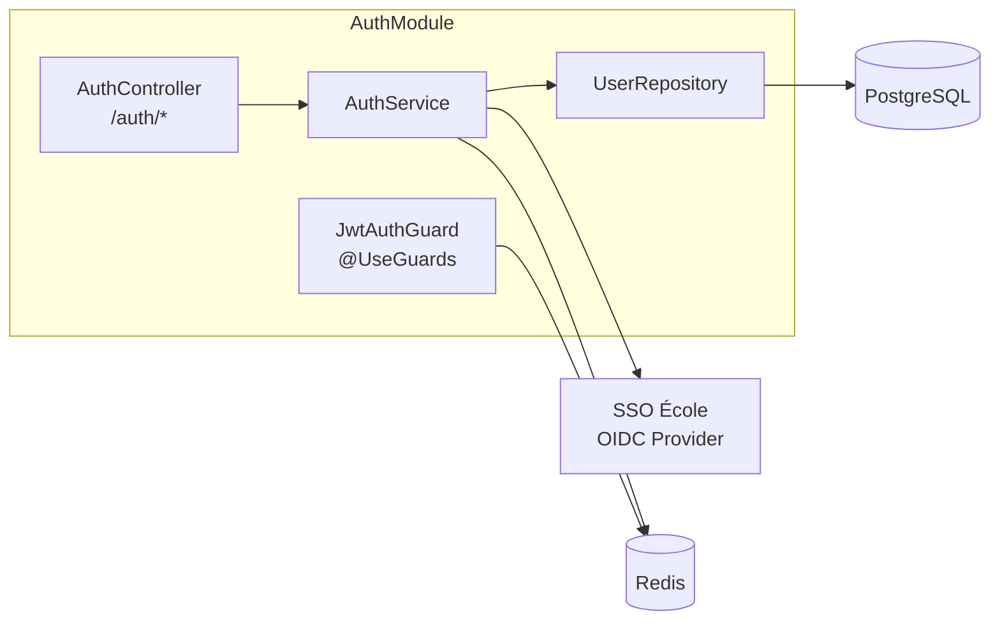
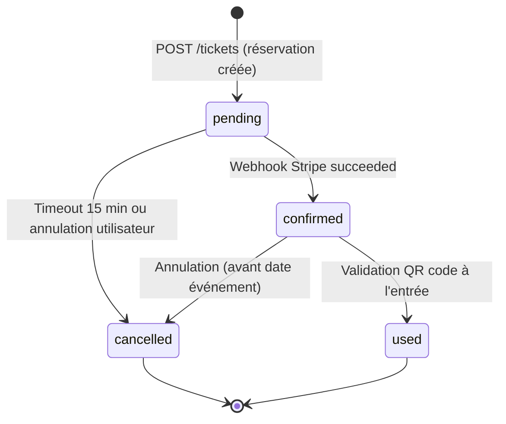
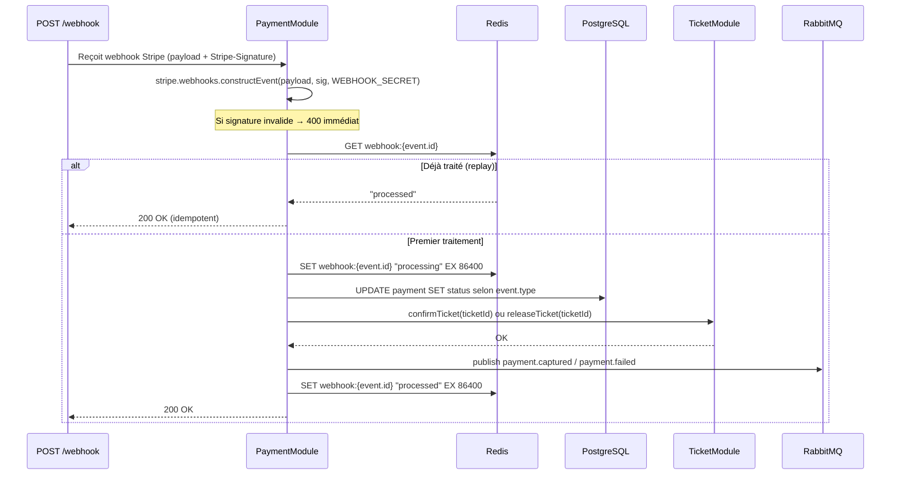

# §7 — Conception détaillée par module

*Dernière mise à jour : 13/05/2026*

Cette section documente la conception interne des trois modules les plus critiques de l'API Backend SupEvents : `AuthModule`, `TicketModule` et `PaymentModule`. Chaque fiche est conçue pour permettre à un développeur qui n'a jamais travaillé sur le projet de démarrer l'implémentation du module sans ambiguïté et sans question orale préalable.

Les trois autres modules (`EventModule`, `NotificationModule`, `UserModule`) sont documentés en §7.4 à §7.6 (à compléter en TP 1.8).

---

## §7.1 — AuthModule

### Responsabilité

`AuthModule` est responsable de l'authentification fédérée des utilisateurs via le SSO de l'école (OIDC/OAuth2), de l'émission et du renouvellement des JWT applicatifs, et de la propagation du contexte d'authentification aux autres modules via un middleware de garde.

### Contrat d'interface

**Endpoints REST exposés :**

| Méthode | Chemin | Description | Auth | Codes retour |
|---|---|---|---|---|
| `GET` | `/api/v1/auth/login` | Redirige vers le SSO école (OIDC authorize) | Public | 302 |
| `GET` | `/api/v1/auth/callback` | Reçoit le code OIDC, échange contre JWT applicatif | Public | 200, 400, 401 |
| `POST` | `/api/v1/auth/refresh` | Renouvelle le JWT via refresh token | Public (refresh token) | 200, 401 |
| `POST` | `/api/v1/auth/logout` | Révoque le refresh token, vide la session Redis | JWT | 204, 401 |
| `GET` | `/api/v1/auth/me` | Retourne le profil de l'utilisateur connecté | JWT | 200, 401 |

**Événements publiés sur RabbitMQ :** aucun (module synchrone pur).

**Événements consommés depuis RabbitMQ :** aucun.

**Appels sortants :**
- SSO École → `GET {SSO_BASE_URL}/.well-known/openid-configuration` (découverte OIDC)
- SSO École → `POST {SSO_TOKEN_URL}` (échange code → tokens OIDC)
- Redis → `SET/GET/DEL session:{user_id}` (sessions et refresh tokens hashés)

### Architecture interne



Le `JwtAuthGuard` est un middleware NestJS global appliqué sur toutes les routes sauf celles explicitement décorées `@Public()`. Il extrait le JWT de l'en-tête `Authorization: Bearer`, vérifie la signature avec la clé publique et interroge Redis pour vérifier que le token n'a pas été révoqué.

### Algorithme critique : Flow OIDC complet

```
FUNCTION handleOidcCallback(code, state):
  // 1. Vérifier le state anti-CSRF (doit correspondre à celui stocké en session)
  IF NOT validateState(state, session.oidc_state):
    THROW 400 Bad Request "invalid_state"
  
  // 2. Échanger le code contre les tokens OIDC
  oidcTokens = POST(SSO_TOKEN_URL, {code, redirect_uri, client_id, client_secret})
  idToken = oidcTokens.id_token
  
  // 3. Valider le id_token (signature, issuer, audience, expiration)
  claims = verifyJwt(idToken, ssoPublicKey)
  IF NOT valid: THROW 401 Unauthorized
  
  // 4. Upsert utilisateur en base (first-login provisioning)
  user = UserRepository.findBySsoSub(claims.sub)
  IF user IS NULL:
    user = UserRepository.create({sso_sub: claims.sub, email: claims.email, 
                                   first_name: claims.given_name, role: 'etudiant'})
  
  // 5. Émettre JWT applicatif (courte durée : 1h)
  appJwt = signJwt({sub: user.id, email: user.email, role: user.role, exp: now+3600})
  
  // 6. Émettre refresh token (longue durée : 30 jours) et le stocker hashé dans Redis
  refreshToken = generateSecureRandom(64)
  Redis.SET("refresh:{hash(refreshToken)}", user.id, EX 30*24*3600)
  
  RETURN {access_token: appJwt, refresh_token: refreshToken}
```

### Gestion des erreurs

| Code interne | Cause | Comportement | Code HTTP |
|---|---|---|---|
| `AUTH_001` | State OIDC invalide ou expiré | Log warn, rejet de la requête | 400 |
| `AUTH_002` | Code OIDC invalide ou expiré | Log warn, retour page d'erreur | 401 |
| `AUTH_003` | Token JWT expiré | Réponse avec `WWW-Authenticate: Bearer error="invalid_token"` | 401 |
| `AUTH_004` | Token JWT révoqué (logout explicite) | Réponse 401, suppression Redis | 401 |
| `AUTH_005` | Refresh token inexistant ou révoqué | Log warn, réponse 401 | 401 |
| `AUTH_006` | SSO école indisponible | Log error, réponse 502 avec message explicite | 502 |

### Cas limites identifiés

**Cas limite : Token JWT révoqué côté SSO mais encore valide localement**
Le SSO école peut révoquer une session utilisateur (ex : suspension du compte étudiant) sans que notre JWT applicatif soit invalidé.
*Décision retenue :* durée de vie du JWT limitée à 1h. Pour une révocation immédiate, l'admin peut appeler `POST /api/v1/admin/users/{id}/revoke-sessions` qui purge toutes les entrées Redis de l'utilisateur. Les JWTs en cours de validité seront invalides à leur prochaine utilisation grâce au garde Redis.

**Cas limite : Premier login d'un utilisateur dont l'email existe déjà en base**
Si un admin a pré-créé un compte utilisateur avec l'email, et que cet utilisateur se connecte via SSO pour la première fois.
*Décision retenue :* la recherche se fait d'abord sur `sso_sub`. Si `sso_sub` est null et que l'email correspond, on met à jour le `sso_sub` et on retourne l'utilisateur existant (migration en douceur).

---

## §7.2 — TicketModule

### Responsabilité

`TicketModule` est responsable de l'allocation de places sur jauge limitée, de la gestion du cycle de vie d'un ticket (`pending → confirmed → cancelled → used`), et de la génération de QR codes authentifiés pour le contrôle d'accès.

### Contrat d'interface

**Endpoints REST exposés :**

| Méthode | Chemin | Description | Auth | Codes retour |
|---|---|---|---|---|
| `POST` | `/api/v1/tickets` | Crée une réservation (statut pending) | JWT | 201, 400, 409, 422 |
| `GET` | `/api/v1/tickets/:id` | Récupère un ticket par ID | JWT | 200, 403, 404 |
| `GET` | `/api/v1/tickets/me` | Liste les tickets de l'utilisateur connecté | JWT | 200 |
| `DELETE` | `/api/v1/tickets/:id` | Annule un ticket (si statut != used) | JWT | 204, 403, 409 |
| `POST` | `/api/v1/tickets/:id/validate` | Valide le QR code à l'entrée de l'événement | JWT + role:organisateur | 200, 400, 409 |

**Événements publiés sur RabbitMQ :**
- `ticket.confirmed` sur le topic `tickets.events.v1` (publié par PaymentModule après confirmation paiement)
- `ticket.cancelled` sur le topic `tickets.events.v1` (publié lors de l'annulation)

**Événements consommés :** aucun (TicketModule est producteur via PaymentModule).

**Appels sortants :**
- `EventModule` → `IEventService.checkAvailability(eventId)` (vérification jauge)
- `PaymentModule` → `IPaymentService.confirmTicket(ticketId)` (confirmation après paiement)
- PostgreSQL → transactions ACID pour l'allocation concurrente

### Architecture interne



### Algorithme critique : Allocation concurrente sur la dernière place

```
FUNCTION createTicket(userId, eventId):
  // Idempotence : vérifier si une réservation active existe déjà
  existing = PG.query(
    "SELECT id FROM tickets WHERE user_id=$1 AND event_id=$2 AND status != 'cancelled'",
    [userId, eventId]
  )
  IF existing: THROW 409 Conflict "TICKET_ALREADY_EXISTS"
  
  // Transaction avec verrou pessimiste sur la ligne Event
  BEGIN TRANSACTION
    event = PG.query(
      "SELECT id, remaining_spots, price_cents FROM events WHERE id=$1 FOR UPDATE",
      [eventId]
    )
    
    IF event.remaining_spots = 0:
      // Proposer la liste d'attente
      position = PG.INSERT(waiting_list_entries, {userId, eventId})
      ROLLBACK
      RETURN {status: "waitlisted", position}
    
    // Décrémenter et insérer ticket atomiquement
    PG.query("UPDATE events SET remaining_spots = remaining_spots - 1 WHERE id=$1", [eventId])
    ticket = PG.INSERT(tickets, {userId, eventId, status: "pending"})
  COMMIT
  
  RETURN ticket
```

*Voir ADR-002 pour la justification du verrou pessimiste vs optimiste.*

### Gestion des erreurs

| Code interne | Cause | Comportement | Code HTTP |
|---|---|---|---|
| `TICKET_001` | Ticket déjà existant pour (user, event) | Retour du ticket existant si pending, 409 si confirmé | 409 |
| `TICKET_002` | Événement complet au moment de l'insertion | Proposition liste d'attente | 422 |
| `TICKET_003` | Tentative d'annuler un ticket déjà utilisé | Rejet immédiat | 409 |
| `TICKET_004` | QR code invalide (signature incorrecte) | Log warn fraud attempt | 400 |
| `TICKET_005` | QR code déjà scanné (ticket.used) | Log warn double scan | 409 |

### Cas limites identifiés

**Cas limite : Double-clic sur "S'inscrire"**
Deux requêtes `POST /tickets` simultanées avec le même (userId, eventId).
*Décision retenue :* La requête `SELECT ... FOR UPDATE` sérialise les deux transactions. La première s'exécute et insère le ticket. La seconde retrouve l'entrée existante et retourne 409. Le verrou pessimiste rend ce cas impossible sans condition de course.

**Cas limite : Annulation après que le paiement est capturé mais avant la confirmation**
Race condition entre le webhook Stripe et l'annulation utilisateur.
*Décision retenue :* L'annulation via `DELETE /tickets/:id` est bloquée si `status = 'confirmed'`. L'annulation d'un ticket `pending` est autorisée ; si le webhook Stripe arrive ensuite, il retrouve le ticket `cancelled` et publie `payment.failed` pour déclencher un remboursement manuel (v1).

---

## §7.3 — PaymentModule

### Responsabilité

`PaymentModule` orchestre les interactions avec l'API Stripe pour la création, la capture et la réconciliation des paiements. Il garantit l'idempotence de toutes les opérations de paiement et publie les événements de domaine résultants vers RabbitMQ.

### Contrat d'interface

**Endpoints REST exposés :**

| Méthode | Chemin | Description | Auth | Codes retour |
|---|---|---|---|---|
| `POST` | `/api/v1/payments/initiate` | Crée un PaymentIntent Stripe pour un ticket | JWT | 201, 400, 422 |
| `POST` | `/api/v1/payments/webhook` | Reçoit les webhooks Stripe | HMAC | 200, 400 |
| `GET` | `/api/v1/payments/:id` | Récupère un paiement par ID | JWT | 200, 403, 404 |
| `GET` | `/api/v1/payments/me` | Liste les paiements de l'utilisateur | JWT | 200 |

**Événements publiés sur RabbitMQ :**
- `payment.captured` sur `payments.events.v1` → consommé par NotificationModule
- `payment.failed` sur `payments.events.v1` → consommé par NotificationModule

**Événements consommés :** aucun.

**Appels sortants :**
- Stripe → `POST /v1/payment_intents` (création)
- Stripe → `GET /v1/payment_intents/{id}` (réconciliation)
- Redis → clé d'idempotence `webhook:{stripe_event_id}` (TTL 24h)
- PostgreSQL → INSERT/UPDATE Payment, UPDATE Ticket

### Architecture interne



### Algorithme critique : Réception webhook avec idempotence

```
FUNCTION handleWebhook(rawPayload, stripeSignature):
  // Vérification signature HMAC (jamais bypassée)
  TRY:
    event = stripe.webhooks.constructEvent(rawPayload, stripeSignature, WEBHOOK_SECRET)
  CATCH SignatureVerificationError:
    LOG warn "Invalid webhook signature"
    THROW 400 Bad Request
  
  // Clé d'idempotence basée sur l'ID Stripe de l'événement
  idempotencyKey = "webhook:" + event.id
  existing = Redis.GET(idempotencyKey)
  IF existing == "processed": RETURN 200 OK  // Replay détecté
  
  Redis.SET(idempotencyKey, "processing", EX=86400)
  
  SWITCH event.type:
    CASE "payment_intent.succeeded":
      updatePaymentStatus(event.data.object.id, "captured")
      ticketId = event.data.object.metadata.ticket_id
      TicketModule.confirmTicket(ticketId)
      RabbitMQ.publish("payment.captured", {ticketId, userId, eventId})
    
    CASE "payment_intent.payment_failed":
      reason = event.data.object.last_payment_error.code
      updatePaymentStatus(event.data.object.id, "failed", reason)
      TicketModule.releaseTicket(ticketId)
      RabbitMQ.publish("payment.failed", {ticketId, userId, reason})
  
  Redis.SET(idempotencyKey, "processed", EX=86400)
  RETURN 200 OK
```

### Gestion des erreurs

| Code interne | Cause | Comportement | Code HTTP |
|---|---|---|---|
| `PAY_001` | Signature webhook Stripe invalide | Log warn, rejet 400 | 400 |
| `PAY_002` | PaymentIntent Stripe introuvable | Log error, investigation requise | 404 |
| `PAY_003` | Montant incohérent entre ticket et PaymentIntent | Log error critique, gel du paiement | 422 |
| `PAY_004` | Stripe API indisponible | Retry exponentiel x3, puis DLQ | 502 |
| `PAY_005` | Paiement orphelin (ticket annulé avant capture) | Log warn, remboursement Stripe automatique si possible | 409 |

### Cas limites identifiés

**Cas limite : Webhook Stripe reçu deux fois (replay)**
Stripe garantit une livraison `at-least-once`. Le même `payment_intent.succeeded` peut être reçu deux fois.
*Décision retenue :* idempotence par `event.id` Stripe stocké dans Redis (TTL 24h). Le second replay retourne 200 OK immédiatement sans re-traitement. Voir ADR-003.

**Cas limite : Paiement capturé mais ticket en statut `cancelled` (annulation entre webhook et confirmation)**
*Décision retenue :* `TicketModule.confirmTicket` vérifie le statut avant de confirmer. Si le ticket est `cancelled`, PaymentModule déclenche un remboursement Stripe immédiat (`stripe.refunds.create`) et publie `payment.failed` avec `reason: 'ticket_already_cancelled'`.

---

## §7.4 — EventModule (résumé)

**Responsabilité :** Gère le cycle de vie d'un événement (brouillon → publié → annulé → archivé), la jauge, et le catalogue public. *Documentation complète à compléter en TP 1.8.*

## §7.5 — NotificationModule (résumé)

**Responsabilité :** Consomme les événements RabbitMQ et envoie les notifications multi-canal (email via SendGrid, in-app). Stratégie de retry avec DLQ après 3 tentatives. *Documentation complète à compléter en TP 1.8.*

## §7.6 — UserModule (résumé)

**Responsabilité :** Gère le profil utilisateur, les préférences, le droit à l'oubli RGPD et la validation/révocation du statut d'organisateur. *Documentation complète à compléter en TP 1.8.*
