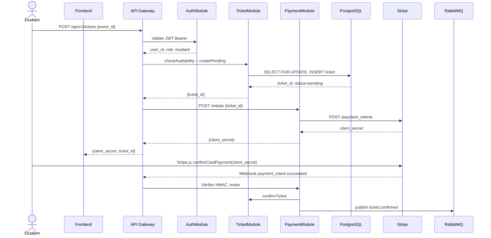
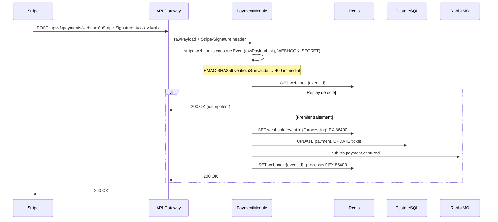

# §9 — Exigences transverses

*Dernière mise à jour : 13/05/2026*

## §9.1 — Sécurité (analyse STRIDE)

### §9.1.1 — Flux 1 : Inscription payante

Ce flux couvre l'enchaînement depuis le clic "S'inscrire" sur la fiche événement jusqu'à la confirmation du ticket après capture du paiement Stripe. Il implique `EventModule`, `TicketModule`, `PaymentModule`, Stripe et RabbitMQ.

C'est le flux le plus critique du système : il manipule des données financières, alloue des ressources limitées (places) et engage la conformité PCI-DSS. La moindre faille sur ce flux peut entraîner des pertes financières (double facturation, places fantômes) ou exposer des données personnelles.

**Tableau STRIDE :**

| Menace | Risque identifié | Mesure de défense retenue |
|---|---|---|
| **S — Spoofing** | Un attaquant usurpe l'identité d'un étudiant légitime pour s'inscrire à ses frais en volant son JWT | JWT à courte durée de vie (1h) + stockage côté serveur des refresh tokens hashés dans Redis. Révocation immédiate possible via l'admin. `HttpOnly` cookie ou stockage mémoire pour le JWT côté client (jamais `localStorage`). |
| **T — Tampering** | Modification du montant du PaymentIntent entre la création et la capture (ex : interception réseau ou manipulation du client Stripe.js) | Le montant du PaymentIntent est fixé côté serveur lors de la création (`POST /payment_intents`). Stripe signe les webhooks avec HMAC-SHA256. Vérification du montant dans le webhook : si `amount != ticket.price_cents`, le paiement est gelé et une alerte est émise. |
| **R — Repudiation** | Un étudiant prétend ne jamais s'être inscrit pour obtenir un remboursement injustifié | Audit log immuable de toutes les transitions d'état des tickets et paiements (table `audit_log` append-only). Chaque entrée contient `user_id`, `action`, `timestamp`, `ip_address`, `user_agent`. |
| **I — Information Disclosure** | Les données de carte bancaire transitent par nos serveurs et sont exposées en log | Stripe.js collecte les données de carte directement côté navigateur et les envoie à Stripe. Nos serveurs ne voient jamais les données de carte. Logs sanitisés : aucun champ sensible (`card_number`, `cvv`) dans les logs. |
| **D — Denial of Service** | Un attaquant crée des centaines de réservations `pending` pour saturer la jauge et bloquer les inscriptions légitimes | Rate limiting par user_id sur `POST /tickets` : 5 req/min. Expiration automatique des tickets `pending` après 15 minutes via job cron. Monitoring des tickets `pending` anormalement vieux. |
| **E — Elevation of Privilege** | Un étudiant manipule la requête pour s'inscrire avec le rôle `organisateur` et accéder aux endpoints de gestion | Le rôle est extrait du JWT signé côté serveur, jamais du body de la requête. Le `JwtAuthGuard` + `RolesGuard` vérifient le rôle sur chaque endpoint protégé. Un étudiant ne peut pas s'auto-élever en rôle `organisateur` sans validation par un admin. |

---

### §9.1.2 — Flux 2 : Réception webhook Stripe

Ce flux couvre la réception du `POST` Stripe vers `/api/v1/payments/webhook`, la vérification de l'intégrité du message, et la mise à jour du statut du paiement jusqu'à la publication de l'événement `payment.captured`. Ce flux est techniquement distinct car il est initié par un système externe automatisé, sans authentification JWT.

Le risque principal est le replay et la falsification : n'importe qui connaissant l'URL du webhook pourrait tenter d'envoyer de fausses confirmations de paiement. La signature HMAC est l'unique mécanisme d'authentification de ce flux.

**Tableau STRIDE :**

| Menace | Risque identifié | Mesure de défense retenue |
|---|---|---|
| **S — Spoofing** | Un tiers envoie un faux webhook `payment_intent.succeeded` pour confirmer un ticket sans avoir payé | Vérification obligatoire de la signature HMAC-SHA256 via `stripe.webhooks.constructEvent()`. Le `WEBHOOK_SECRET` est stocké dans le vault, jamais en variable d'environnement en clair. Un webhook sans signature valide est rejeté en 400 sans log de détail (pour ne pas aider l'attaquant). |
| **T — Tampering** | Un attaquant modifie le payload du webhook (ex : change le `amount` ou le `ticket_id`) | La signature HMAC couvre l'intégralité du payload raw (bytes bruts, avant parsing JSON). Toute modification invalide la signature. Le payload n'est parsé qu'après vérification de la signature. |
| **R — Repudiation** | Stripe prétend avoir envoyé un webhook que nous n'aurions jamais reçu (ou inversement) | Conservation des webhooks reçus dans la table `webhook_events` avec `stripe_event_id`, `received_at`, `processing_status`. Stripe conserve un historique dans son Dashboard. Comparaison possible en cas de litige. |
| **I — Information Disclosure** | Les logs du webhook contiennent des informations sensibles sur les transactions | Politique de log pour le webhook : seuls `stripe_event_id`, `event_type`, `processing_status` sont loggués. Les champs `last4`, `brand`, `customer.email` ne sont jamais loggués. |
| **D — Denial of Service** | Stripe envoie des dizaines de webhooks en rafale (ex : en cas d'incident de leur infrastructure) → saturation du backend | L'endpoint webhook est exclu du rate limiting global (source de confiance après vérification HMAC). Mais la vérification HMAC est elle-même un filtre coûteux limité par le volume. File RabbitMQ pour découpler la réception de l'exécution. |
| **E — Elevation of Privilege** | Non applicable — le webhook est traité par un handler dédié sans contexte utilisateur. Il ne peut pas déclencher d'action avec des droits élevés au-delà de la confirmation/annulation d'un paiement existant. | Non applicable — le handler webhook a des droits limités à la mutation des entités `Payment` et `Ticket`. Il ne peut pas créer d'utilisateurs, modifier des rôles ou accéder à d'autres ressources. |

---

## §9.2 — Performance

Les exigences ci-dessous sont directement issues des ENF du CDC. Pour chaque exigence, l'objectif est formulé de manière mesurable, la solution technique est détaillée et la méthode de vérification est opérationnelle.

### Fiche ENF-P1 : Latence sur les endpoints critiques

| Colonne | Valeur |
|---|---|
| **Objectif mesurable** | P95 < 500 ms sur `GET /api/v1/events` et `POST /api/v1/tickets` sous charge de 500 utilisateurs simultanés, mesurés sur une fenêtre glissante de 1 minute en production |
| **Solution technique** | (1) Cache Redis sur `GET /api/v1/events` (TTL 60s, invalidation sur modification d'événement) ; (2) Index PostgreSQL sur `Event(status, start_date)` pour le catalogue et `Ticket(user_id, event_id)` pour la vérification de doublon ; (3) Connection pooling PgBouncer (pool size = 20) ; (4) Réponses paginées par défaut (limit=20) pour limiter la taille des résultats |
| **Composants impactés** | `EventModule` (cache Redis, requêtes PostgreSQL), `TicketModule` (index PostgreSQL, transaction FOR UPDATE) |
| **Méthode de vérification** | Tests de charge k6 lancés en CI sur l'environnement de staging avant chaque release. Scénario : 500 VUs pendant 3 min. Seuil bloquant : P95 > 500 ms → build failed. En production : métriques Prometheus + alertes PagerDuty si P95 > 400 ms (seuil d'alerte préventif). |

### Fiche ENF-P2 : Disponibilité mensuelle

| Colonne | Valeur |
|---|---|
| **Objectif mesurable** | 99,5 % de disponibilité mensuelle. Budget d'erreur : 30 jours × 24h × 60min × 0,5 % = **218 min = 3h 38min d'indisponibilité tolérée par mois** |
| **Solution technique** | (1) Déploiement sur au moins 2 instances backend (redondance active) avec load balancer ; (2) Health checks automatiques toutes les 30s (redémarrage automatique si unhealthy) ; (3) PostgreSQL avec réplica en lecture (failover < 1 min) ; (4) Redis Sentinel pour la haute disponibilité du cache ; (5) Circuit breaker sur les appels Stripe (dégradé gracieux si Stripe indisponible) |
| **Composants impactés** | Infrastructure (load balancer, déploiement multi-instance), PostgreSQL, Redis |
| **Méthode de vérification** | Monitoring continu via UptimeRobot (check HTTP toutes les 1 min). SLO Dashboard Grafana. Calcul automatique du burn rate mensuel. Alerte si burn rate > 2× (consommation budget x2 trop vite) → intervention immédiate. |

### Fiche ENF-P3 : Capacité à absorber un pic d'inscriptions

| Colonne | Valeur |
|---|---|
| **Objectif mesurable** | Absorber 500 inscriptions simultanées lors de l'ouverture d'un événement populaire sans dégradation du P95 (< 500 ms) et sans perte de données (0 double-inscription tolérée) |
| **Solution technique** | (1) Verrou pessimiste `SELECT FOR UPDATE` sur `Event.remaining_spots` pour garantir l'atomicité ; (2) Redis pour le rate limiting (5 req/min par user sur `POST /tickets`) pour amortir les rafales ; (3) Autoscaling horizontal du backend (déclenchement si CPU > 70 %) ; (4) Job de réconciliation asynchrone pour les tickets `pending` expirés (ne pas bloquer le flux principal) |
| **Composants impactés** | `TicketModule` (transactions PostgreSQL), API Gateway (rate limiting), infrastructure (autoscaling) |
| **Méthode de vérification** | Scénario de spike test k6 : rampe de 0 à 500 VUs en 10s, tous ciblant `POST /tickets` sur le même événement. Assertions : 0 erreur 500, 0 doublon en base, P95 < 500 ms. Lancé en pre-release sur staging. |

---

## §9.3 — RGPD

### a) Registre des traitements (extrait)

| Donnée personnelle | Finalité | Base légale | Durée de rétention |
|---|---|---|---|
| Email | Authentification, envoi des confirmations de tickets et notifications de paiement | Exécution du contrat (inscription à la plateforme) | 3 ans après dernière connexion, puis anonymisation |
| Nom et prénom | Identification de l'utilisateur dans l'interface, personnalisation des emails de confirmation | Exécution du contrat | 3 ans après dernière connexion, puis anonymisation |
| Identifiant SSO (`sso_sub`) | Fédération d'identité avec le SSO école, unicité du compte | Intérêt légitime de l'établissement (gestion des accès étudiants) | Durée de la scolarité + 1 an |
| Historique d'inscriptions (liste des ticket_id) | Accès à l'historique personnel, prévention de la fraude | Exécution du contrat | 5 ans (obligation légale de conservation des preuves de transaction) |
| Identifiant customer Stripe (`stripe_customer_id`) | Facilitation des paiements récurrents (mémorisation du moyen de paiement côté Stripe) | Consentement explicite (case à cocher au premier paiement) | Jusqu'à révocation du consentement + 1 an |
| Adresse IP de connexion | Sécurité (détection d'intrusion, rate limiting), journalisation des accès | Intérêt légitime (sécurité du système) | 90 jours |
| Corps des emails de notification (inclut prénom) | Livraison des notifications transactionnelles | Exécution du contrat | 1 an après envoi, puis purge |

### b) Mécanismes de protection transverses

- **Chiffrement en transit (TLS 1.3)** : toutes les communications HTTP entre clients et serveurs, entre backend et bases de données (PostgreSQL avec `ssl=require`, Redis avec TLS), et entre backend et Stripe/SendGrid sont chiffrées. Certificats Let's Encrypt avec renouvellement automatique.
- **Chiffrement au repos des données sensibles** : les champs `email`, `first_name`, `last_name` de la table `User` sont chiffrés au niveau applicatif (AES-256-GCM) avant stockage. La clé de chiffrement est stockée dans HashiCorp Vault (ou AWS KMS en production), jamais en dur dans le code.
- **Hashage des refresh tokens** : les refresh tokens sont stockés dans Redis sous forme hashée (SHA-256). En cas de compromission de Redis, les tokens bruts ne sont pas récupérables.
- **Gestion des secrets via vault** : les clés API (Stripe, SendGrid, SSO), les secrets JWT et les secrets webhook sont injectés via variables d'environnement depuis HashiCorp Vault. Aucune clé secrète dans le code source ni dans les fichiers de configuration versionnés.
- **Séparation stricte des environnements** : les bases de données `development`, `staging` et `production` sont des instances distinctes. Les données de production ne sont jamais copiées en développement.
- **Rotation des clés de chiffrement** : rotation trimestrielle des clés AES et JWT. La rotation est transparente grâce à un mécanisme de double-clé (ancienne clé acceptée en lecture pendant 48h pendant la migration).
- **Audit log inviolable** : la table `audit_log` est `INSERT ONLY` (aucun `UPDATE` ou `DELETE` autorisé, enforced par une règle PostgreSQL). Elle trace toutes les mutations sensibles (changement de rôle, accès aux données personnelles, droit à l'oubli exercé).

### c) Procédures liées aux droits des personnes

**Droit d'accès (délai légal : 30 jours)**

- *Qui déclenche :* L'utilisateur via `GET /api/v1/users/me/export` (auto-service) ou un admin via `GET /api/v1/admin/users/:id/export`.
- *Qui exécute :* `UserModule` collecte et agrège les données de toutes les tables (User, Ticket, Payment, Notification) filtrées par `user_id`.
- *Format de livraison :* JSON signé + CSV lisible, transmis par email sécurisé (lien de téléchargement à usage unique, valable 24h).
- *Traces conservées :* Une entrée `audit_log` de type `GDPR_ACCESS_REQUEST` avec `user_id`, `requested_by`, `timestamp`, `delivered_at`.

**Droit à l'oubli (délai légal : 30 jours)**

- *Qui déclenche :* L'utilisateur via `DELETE /api/v1/users/me` ou un admin via `DELETE /api/v1/admin/users/:id`.
- *Qui exécute :* `UserModule` — procédure d'anonymisation (pas de suppression physique pour préserver l'intégrité référentielle).
- *Résolution de la tension RGPD vs obligation comptable :* Les tickets et paiements associés doivent être conservés 5 ans (obligation légale). La solution retenue est la **pseudonymisation** : `email` → `deleted@anon.supevents.invalid`, `first_name` → `[Supprimé]`, `last_name` → `[Supprimé]`, `sso_sub` → UUID aléatoire stable (préserve l'unicité sans identifier). Les tables `Ticket` et `Payment` conservent le `user_id` qui pointe vers ce compte anonymisé — les montants et dates de transaction restent consultables à des fins comptables mais ne peuvent plus être liés à une personne réelle.
- *Traces conservées :* Une entrée `audit_log` de type `GDPR_ERASURE_REQUEST` avec `user_id` (avant anonymisation), `requested_by`, `timestamp`, `completed_at`, liste des tables modifiées.

**Droit de rectification (délai légal : 30 jours)**

- *Qui déclenche :* L'utilisateur via `PUT /api/v1/users/me` (champs modifiables : `first_name`, `last_name`, `email`).
- *Qui exécute :* `UserModule` — mise à jour en base et propagation aux systèmes tiers.
- *Propagation vers les tiers :* si l'email change, `UserModule` notifie `PaymentModule` qui met à jour le customer Stripe (`stripe.customers.update`) et `NotificationModule` qui met à jour la liste SendGrid. Ces opérations sont faites de manière synchrone ; en cas d'échec chez Stripe ou SendGrid, la modification est rollbackée et l'utilisateur est informé de réessayer.
- *Traces conservées :* Entrée `audit_log` de type `GDPR_RECTIFICATION` avec champs modifiés (noms des colonnes, sans les valeurs) et `timestamp`.
